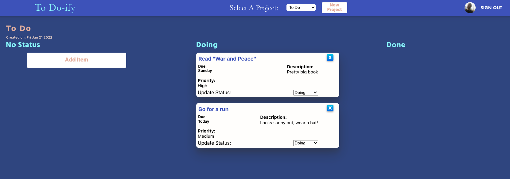
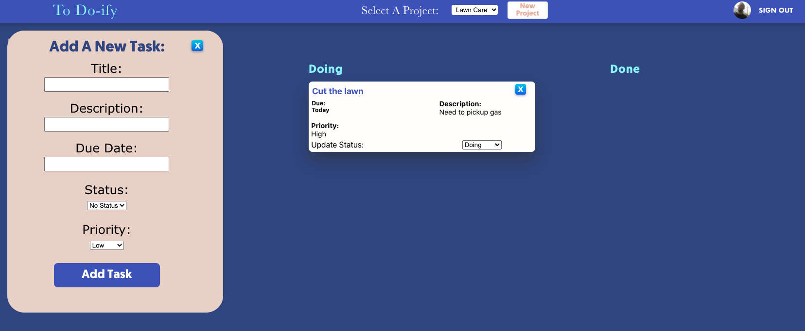

<div align="center">

## To Do-ify 


</div>

### Table Of Contents:
1. [Live Deployment](#link-to-deployment)
2. [Getting Started](#getting-started)
3. [Description](#description)
4. [Pictures](#pictures)
5. [Functionality](#functionality)
6. [Technologies Used](#technologies-used)
7. [Things I Learned](#things-i-learned)
8. [License](#license)
9. [Acknowledgements](#acknowledgements)

### Link To Deployment
🖥 &nbsp; View a live demo of this project at: [To Do-ify](https://github.com/EpictetusZ1/todo-list)

<sup>[Back to top](#table-of-contents)</sup>

## Getting Started

1. ⬇️ Clone the repository to your local machine
   ```shell
   git clone git@github.com:EpictetusZ1/todo-list.git
   ```
2. Navigate into the project
   ```shell
   cd todo-list
   ```
3. Install project dependencies with npm
   ```shell
   npm install
   ```
4. 🏃‍ Run project
   ```shell
   npm run start
   ```

<sup>[Back to top](#table-of-contents)</sup>

## Description
An assignment from [The Odin Project](https://www.theodinproject.com/)

### Update:

##### A *complete rebuild* of the project has been done using:
- React (useReducer and useContext hooks)
- TypeScript
- Firebase:
   - Firestore Database
   - Authentication via Google Auth. provider
- Styled Components


<sup>[Back to top](#table-of-contents)</sup>

## Pictures



<sup>[Back to top](#table-of-contents)</sup>

## Functionality

- Create projects in which to organize your 'To Dos'
- Create and store a list of 'To Do Items', sorted by project, then status
- Change status of 'To Do Item'
- Option to choose Firebase - to store your data in the could or ```localStorage```
- Data persistence on both storage options
- Preform all CRUD operations on 'To Dos'

<sup>[Back to top](#table-of-contents)</sup>

## Technologies Used

- React
- TypeScript
  - Styled Components
- Firebase
  - Firestore
  - Google Authenticator
  
<sup>[Back to top](#table-of-contents)</sup>

## Things I Learned

#### On refactor to React / TypeScript:

- Defining object "shapes" with `interfaces`
- TypeScript best practices
- Styled components `Global styles`
- React Hooks: `useContext()` and `useReducer()` to provide global state management store (single source of truth)
- Firestore integration as a backend or BaaS (Backend as a Service)
- Google authentication to allow users access to their unique data in an easy and secure way

#### On first version:

- Public field declarations for code readability
- OOP Principles
- SOLID Design
- Color Palette design
- Deep Cloning of objects when retrieving from ```localStorage```
- The benefits / downsides of 'deep' vs 'shallow' cloning
- Troubleshooting ```localStorage``` arrays as they can get inverted when being written to memory
- Compartmentalization and the use of 'handler' functions to separate code functionality

<sup>[Back to top](#table-of-contents)</sup>

## License
Distributed under the MIT License. See `LICENSE.txt` for more information.

<sup>[Back to top](#table-of-contents)</sup>

## Acknowledgements
No attribution required, project was authored by Jack Heaton - ([EpictetusZ1](https://github.com/EpictetusZ1)).

<sup>[Back to top](#table-of-contents)</sup>
